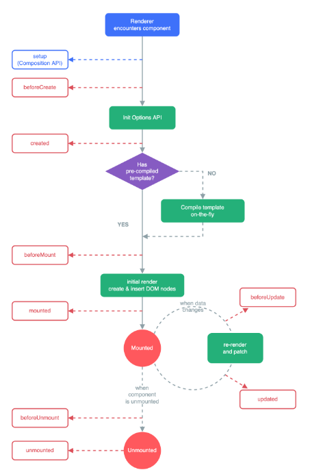

# VUEJS

## Nội dung cơ bản

1. Tìm hiểu ứng dụng Single Page Aplication (SPA) là gì

Single Page Application (SPA) là một ứng dụng web hoặc trang web tương tác mà tải một trang HTML duy nhất và sau đó cập nhật nội dung của trang đó một cách động thông qua JavaScript khi người dùng tương tác với ứng dụng. Điều này giúp mang lại trải nghiệm người dùng mượt mà và nhanh chóng hơn, vì không cần phải tải lại toàn bộ trang khi chuyển đổi giữa các phần khác nhau của ứng dụng.

Đặc điểm của SPA:

-   Tải Trang Duy Nhất: SPA chỉ tải một lần duy nhất toàn bộ trang HTML, CSS và JavaScript cần thiết. Sau đó, mọi thao tác và điều hướng trong trang đều được xử lý bằng JavaScript.

-   Điều Hướng Nhanh: Khi người dùng điều hướng qua các phần khác nhau của ứng dụng, SPA chỉ tải và thay đổi các phần cần thiết trên trang mà không cần tải lại toàn bộ trang từ máy chủ.

-   Trải Nghiệm Người Dùng Mượt Mà: Việc không phải tải lại toàn bộ trang giúp giảm thời gian chờ đợi và mang lại trải nghiệm người dùng mượt mà hơn.

-   Sử Dụng AJAX và API: SPA thường sử dụng AJAX để gửi và nhận dữ liệu từ máy chủ mà không cần tải lại trang. Điều này cho phép ứng dụng tương tác với máy chủ và cập nhật nội dung một cách nhanh chóng và hiệu quả.

-   Quản Lý Trạng Thái Ứng Dụng: SPA thường sử dụng các thư viện hoặc framework quản lý trạng thái như Vuex (đối với Vue.js) để quản lý dữ liệu và trạng thái của ứng dụng.

2. Vuejs là gì, sử dụng Vuejs tạo ứng dụng SPA

Vue.js là một framework JavaScript tiến bộ dùng để xây dựng giao diện người dùng (UI). Không giống như các framework nguyên khối khác, Vue được thiết kế từ đầu để có thể áp dụng từ từ. Thư viện cốt lõi của Vue tập trung vào lớp view, và dễ dàng tích hợp với các thư viện hoặc dự án hiện có. Vue cũng rất thích hợp để phát triển các ứng dụng single-page application (SPA) khi kết hợp với các công cụ hiện đại và thư viện hỗ trợ khác.

3. Các khởi tạo, chạy một ứng dụng Vuejs bằng dòng lệnh Vue Cli (đọc hướng dẫn trên trang chủ của Vue)
4. Làm quen cấu trúc thư mục của một ứng dụng Vuejs, cách tạo mới các trang trong thư mục Vuejs
5. Viết các component html thuần trong template của Vuejs
6. Data trong Vuejs, các binding data Vuejs với html trên template, v-model…

#### Các Cách Binding Data với HTML trên Template

```js
data: function() {
    return {
      message: 'Hello, Vue!',
      url:'facebook.com',
      isVisible:true,
      items:['1','2','3'],
      count:0
    };
  }

computed:{
    incrementCounter(){
        return this.count++;
    }
}
```

#### 1.Interpolation ({{ }})

Interpolation được sử dụng để hiển thị dữ liệu trong HTML.

```html
<div id="app">
    <p>{{ message }}</p>
</div>
```

#### 2.Directive

v-bind được sử dụng để bind thuộc tính HTML với data.

```html
<div id="app">
    <a v-bind:href="url">Link</a>
</div>
```

v-if được sử dụng để render các phần tử dựa trên điều kiện.

```html
<div id="app">
    <p v-if="isVisible">This is visible</p>
</div>
```

v-for được sử dụng để lặp qua các mảng và render các phần tử tương ứng.

```html
<div id="app">
    <ul>
        <li v-for="(item,i) in items" :key="i">{{ item }}</li>
    </ul>
</div>
```

v-on được sử dụng để bind các sự kiện với phương thức trong Vue instance.

```html
<div id="app">
    <button v-on:click="incrementCounter">Click me</button>
    <p>Counter: {{ counter }}</p>
</div>
```

v-model là một directive đặc biệt trong Vue.js để tạo ra two-way data binding với các input elements, textarea và select. Điều này có nghĩa là khi giá trị của input thay đổi, giá trị trong Vue instance cũng thay đổi, và ngược lại.

```html
<div id="app">
    <input v-model="message" placeholder="Enter a message" />
    <p>{{ message }}</p>
</div>
```

7. Life Circle Hook trong Vuejs
   

8. Các viết các function trong method Vuejs, các gọi các function này (gọi trên template, gọi từ life circle hook, gọi từ function khác …

9. Event trong Vuejs, cách binding event từ template với method trong Vuejs

#### 1.Binding Event với Method trong Template

```html
<div id="app">
    <button @click="doSomething">Click me</button>
</div>
```

#### 4. Truyền Tham Số vào Method

```html
<div id="app">
    <button @click="greet('Hello')">Greet</button>
</div>
```

#### 3.Sử dụng $event để Truyền Đối Tượng Sự Kiện

```html
<div id="app">
    <button @click="showEvent($event)">Show Event</button>
</div>
```

```html
<!-- Ngăn chặn sự kiện lan truyền -->
<button @click.stop="doSomething">Click me</button>

<!-- Ngăn chặn hành vi mặc định -->
<form @submit.prevent="onSubmit">Submit</form>

<!-- Chỉ kích hoạt sự kiện một lần -->
<button @click.once="doSomething">Click me once</button>
```

```html
<!DOCTYPE html>
<html lang="en">
    <head>
        <meta charset="UTF-8" />
        <meta name="viewport" content="width=device-width, initial-scale=1.0" />
        <title>Vue Event Binding Example</title>
    </head>
    <body>
        <div id="app">
            <button @click="incrementCounter">Click me</button>
            <p>Counter: {{ counter }}</p>

            <button @click.stop="doSomething">
                Click me (stop propagation)
            </button>

            <form @submit.prevent="onSubmit">
                <input v-model="inputValue" placeholder="Enter something" />
                <button type="submit">Submit</button>
            </form>

            <button @click.once="alertMessage">Click me once</button>
        </div>
        <script src="https://cdn.jsdelivr.net/npm/vue@2"></script>
        <script>
            new Vue({
                el: "#app",
                data: function () {
                    return {
                        inputValue: "",
                    };
                },
                methods: {
                    doSomething: function () {
                        console.log("Event propagation stopped!");
                    },
                    onSubmit: function () {
                        alert("Form submitted with value: " + this.inputValue);
                    },
                    alertMessage: function () {
                        alert("This will only be shown once.");
                    },
                },
            });
        </script>
    </body>
</html>
```

10. Tìm hiểu computed trong Vuejs

`computed` là một thuộc tính trong Vue.js dùng để khai báo các thuộc tính được tính toán dựa trên các thuộc tính data khác. Các thuộc tính `computed` được tính toán lại một cách tự động khi các thuộc tính mà chúng phụ thuộc thay đổi. Điều này giúp tối ưu hóa hiệu suất của ứng dụng bằng cách tránh tính toán lại các giá trị không cần thiết.

Đơn giản là computed hàm computed đc gọi thì các không bị gọi lại, chỉ những hàm có giá trị thay đổi mới được gọi, không giống như methods khi gọi 1 hàm là tất cả các hàm được gọi

```html
<div id="app">
    <p>Original message: {{ message }}</p>
    <p>Reversed message: {{ reversedMessage }}</p>
</div>

<script src="https://cdn.jsdelivr.net/npm/vue@2"></script>
<script>
    new Vue({
        el: "#app",
        data: {
            message: "Hello Vue.js!",
        },
        computed: {
            reversedMessage: function () {
                return this.message.split("").reverse().join("");
            },
        },
    });
</script>
```

11. Tìm hiểu Watch trong Vuejs

watch là một thuộc tính trong Vue.js dùng để lắng nghe và phản ứng lại các thay đổi của một thuộc tính data hoặc một computed property. watch đặc biệt hữu ích khi bạn cần thực hiện các hành động không đồng bộ hoặc các thao tác tốn kém về mặt hiệu suất khi một giá trị nào đó thay đổi.

```js
const question = ref("");
const answer = ref("I cannot give you an answer until you ask a question!");

watch(question, (newQuestion, oldQuestion) => {
    if (newQuestion.indexOf("?") > -1) {
        answer.value = "Thinking...";
        getAnswer();
    } else {
        answer.value = "Questions usually contain a question mark. ;-)";
    }
});

function getAnswer() {
    setTimeout(() => {
        answer.value = "The answer is 42.";
    }, 1000);
}
```

12. Các truyền dữ liệu từ component cha xuống component con (props)

Component Con (ChildComponent.vue)

```vue
<template>
    <div>
        <p>{{ message }}</p>
    </div>
</template>

<script>
export default {
    props: {
        message: String,
    },
};
</script>
```

Component Cha (ParentComponent.vue)

```vue
<template>
    <div>
        <ChildComponent :message="parentMessage" />
    </div>
</template>

<script>
import ChildComponent from "./ChildComponent.vue";

export default {
    components: {
        ChildComponent,
    },
    data() {
        return {
            parentMessage: "Hello from Parent!",
        };
    },
};
</script>
```

13. Các truyền dữ liệu từ component con lên component cha (emit)
14. Render một list dữ liệu lên template (v-for)
15. Ẩn hiển component trên template theo điều kiện (v-if, v-else, v-show…)
16. Binding style, class vào component trên template theo điều kiện
17. Tìm hiểu router trong Vuejs, thế nào là router-views
18. Các điều hướng (routing) trong vuejs sử dụng router (router link, router push, router go, router replace…)
19. Các lấy các tham số của router trong Vuejs (ví dụ params, query, meta data…)
20. Quản lý trạng thái (store) với Vuex
21. Tìm hiểu state, getter, action, mutation của Vuex
22. Slot component trong Vuejs
23. Mixin trong Vuejs
24. Cài đặt, sử dụng các thư viện js thông qua NPM, Yarn…
25. Sử dụng thư viện UI cho Vuejs (Boostrap-Vue hoặc Vuetify hoặc Element-UI…)
